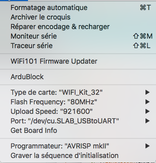

# LoRaWAN on ESP32 Heltec
* Install Arduino
* Heltec boards https://github.com/Heltec-Aaron-Lee/WiFi_Kit_series
* Install driver USB lien https://www.silabs.com/products/development-tools/software/usb-to-uart-bridge-vcp-drivers

# LoRaWAN on ESP32 Heltec
* Install Arduino
* Heltec boards https://github.com/Heltec-Aaron-Lee/WiFi_Kit_series
* Install driver USB lien https://www.silabs.com/products/development-tools/software/usb-to-uart-bridge-vcp-drivers
* Install projet ESP32-Paxcount https://github.com/cyberman54/ESP32-Paxcounter

 :satellite:  :fr:  :us:
