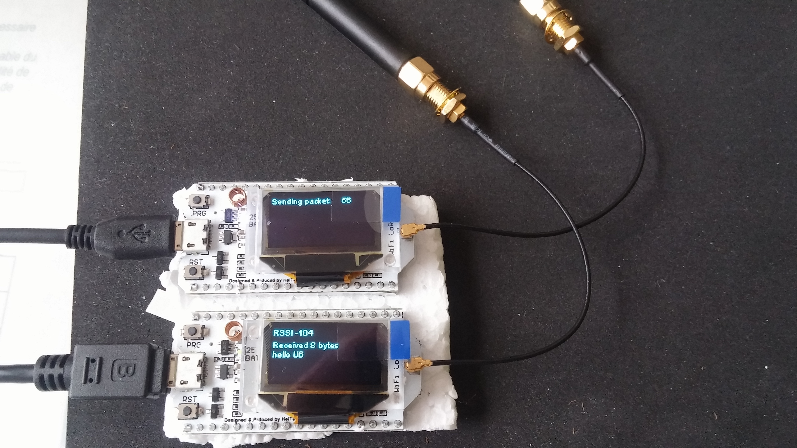
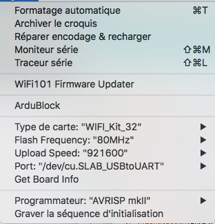

# HOW TO

ESP32 Heltec boards (ESP32 + Wifi + BLE + LoRa SX1276 + OLED display)
* https://robotzero.one/heltec-wifi-kit-32/
* http://www.heltec.cn/project/wifi-lora-32/?lang=en
* Examples https://github.com/Heltec-Aaron-Lee/WiFi_Kit_series/tree/master/esp32/libraries/ESP32/examples

## LoRa on ESP32 Heltec
* Install Arduino IDE https://www.arduino.cc/en/Main/Software
* Heltec boards https://github.com/Heltec-Aaron-Lee/WiFi_Kit_series
* Install Silabs USB driver https://www.silabs.com/products/development-tools/software/usb-to-uart-bridge-vcp-drivers
* Download on board 1 : ./OLED_LoRa_Receiver_868/
* Download on board 2 : ./OLED_LoRa_Sender_868/

## More : LoRaWAN on ESP32 Heltec
* Install Arduino IDE https://www.arduino.cc/en/Main/Software
* Heltec boards https://github.com/Heltec-Aaron-Lee/WiFi_Kit_series
* Install Silabs driver USB  https://www.silabs.com/products/development-tools/software/usb-to-uart-bridge-vcp-drivers
* Install project ESP32-Paxcount https://github.com/cyberman54/ESP32-Paxcounter

# Gallery

# References
* https://github.com/berkutta/esp32_lmic
* https://github.com/espressif/esp-idf
* https://github.com/matthijskooijman/arduino-lmic
* https://github.com/unprovable/LoRaChat
* https://www.thethingsnetwork.org/forum/t/big-esp32-sx127x-topic/10247/18
* https://www.thethingsnetwork.org/labs/story/heltec-lorawan-gps-quick-start

 :satellite:  :fr:  :us:
